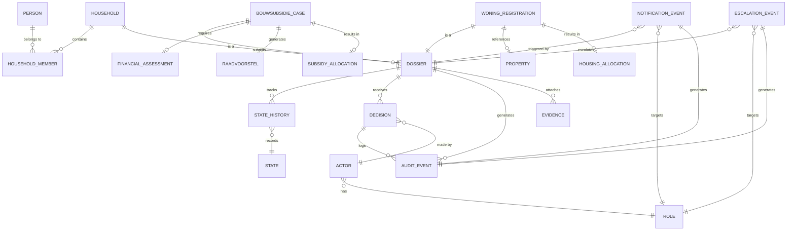

# DVH-IMS V1.2 — Conceptual Entity-Relationship Diagram

**Version:** DVH-IMS-V1.2  
**Status:** DRAFT — Optional Planning Document  
**Created:** 2026-01-24  
**Document Type:** Design / Data Model (Non-Authoritative)  
**Change Policy:** This document does not authorize implementation

---

## 1. Purpose

This document defines the high-level entity-relationship model for DVH-IMS-V1.2. It describes entities and their conceptual relationships without specifying columns, datatypes, or implementation details.

**This is a conceptual artifact only. No columns, datatypes, primary keys, or foreign keys are defined.**

---

## 2. Design Principles

The conceptual data model adheres to the following principles:

| Principle | Data Model Implication |
|-----------|------------------------|
| Dossier-Centric | Dossier is the central entity for both modules |
| Service Separation | Bouwsubsidie and Woning Registratie have distinct entities |
| Shared Core | Person and Household are shared across modules |
| Audit-by-Design | Every entity change is tracked in Audit Event |
| State Tracking | Dossier state history is maintained |

---

## 3. Entity Categories

Entities are organized into the following categories:

| Category | Description |
|----------|-------------|
| Core Entities | Shared across both modules |
| Bouwsubsidie Entities | Specific to Bouwsubsidie module |
| Woning Registratie Entities | Specific to Woning Registratie module |
| Audit Entities | Traceability and compliance |
| Notification Entities | Signaling and escalation |

---

## 4. Core Entities

These entities are shared by both Bouwsubsidie and Woning Registratie modules:

### 4.1 Person

| Aspect | Description |
|--------|-------------|
| Purpose | Represents an individual applicant or household member |
| Relationships | Belongs to Household, Submits Dossier |
| Source | Scope & Objectives (shared core) |

### 4.2 Household

| Aspect | Description |
|--------|-------------|
| Purpose | Represents a group of persons at an address |
| Relationships | Contains Persons, Submits Dossiers |
| Source | Scope & Objectives (shared core) |

### 4.3 Dossier (Abstract)

| Aspect | Description |
|--------|-------------|
| Purpose | Central entity representing an application or registration |
| Relationships | Submitted by Household, Has State History, Has Decisions, Has Evidence |
| Specializations | Bouwsubsidie Case, Woning Registration |
| Source | Dossier State Model |

### 4.4 State

| Aspect | Description |
|--------|-------------|
| Purpose | Represents a dossier lifecycle state |
| Allowed Values | DRAFT, SUBMITTED, IN_REVIEW, REVISION_REQUESTED, REVIEW_APPROVED, APPROVED, REJECTED, ESCALATED, CLOSED_APPROVED, CLOSED_REJECTED |
| Source | Dossier State Model |

### 4.5 Decision

| Aspect | Description |
|--------|-------------|
| Purpose | Represents a formal decision on a dossier |
| Relationships | Applies to Dossier, Made by Actor, Generates Audit Event |
| Source | End-to-End Workflows |

### 4.6 Evidence

| Aspect | Description |
|--------|-------------|
| Purpose | Represents attached documents and supporting materials |
| Relationships | Attached to Dossier |
| Source | Services Decomposition |

---

## 5. Bouwsubsidie Entities

These entities are specific to the Bouwsubsidie module:

### 5.1 Bouwsubsidie Case

| Aspect | Description |
|--------|-------------|
| Purpose | Represents a building subsidy application |
| Relationships | Is a Dossier, Has Financial Assessment, Generates Raadvoorstel |
| Source | Services Decomposition |

### 5.2 Financial Assessment

| Aspect | Description |
|--------|-------------|
| Purpose | Represents the financial evaluation of a subsidy application |
| Relationships | Belongs to Bouwsubsidie Case |
| Source | Services Decomposition |

### 5.3 Raadvoorstel

| Aspect | Description |
|--------|-------------|
| Purpose | Represents the council proposal artifact generated after approval |
| Relationships | Generated from Bouwsubsidie Case (approved only) |
| Note | This is an artifact, not a dossier state |
| Source | Dossier State Model |

### 5.4 Subsidy Allocation

| Aspect | Description |
|--------|-------------|
| Purpose | Represents the allocation of subsidy funds |
| Relationships | Follows Raadvoorstel, Linked to Bouwsubsidie Case |
| Source | Services Decomposition |

---

## 6. Woning Registratie Entities

These entities are specific to the Woning Registratie module:

### 6.1 Woning Registration

| Aspect | Description |
|--------|-------------|
| Purpose | Represents a housing registration application |
| Relationships | Is a Dossier, References Property, May result in Allocation |
| Source | Services Decomposition |

### 6.2 Property

| Aspect | Description |
|--------|-------------|
| Purpose | Represents a housing unit in the registry |
| Relationships | Referenced by Woning Registration |
| Source | Services Decomposition |

### 6.3 Housing Allocation

| Aspect | Description |
|--------|-------------|
| Purpose | Represents the assignment of housing to an applicant |
| Relationships | Results from approved Woning Registration |
| Source | Services Decomposition |

**Note:** Woning Registratie does not generate Raadvoorstel artifacts.

---

## 7. Audit Entities

These entities support traceability and compliance:

### 7.1 Audit Event

| Aspect | Description |
|--------|-------------|
| Purpose | Immutable record of every system action |
| Relationships | Linked to any entity that changes, Records Actor |
| Source | Audit & Legal Traceability |

### 7.2 State History

| Aspect | Description |
|--------|-------------|
| Purpose | Tracks all state transitions for a dossier |
| Relationships | Belongs to Dossier, Generates Audit Events |
| Source | Dossier State Model |

### 7.3 Actor

| Aspect | Description |
|--------|-------------|
| Purpose | Represents the user who performed an action |
| Relationships | Linked to Audit Event, Has Role |
| Source | Roles & Authority Matrix |

### 7.4 Role

| Aspect | Description |
|--------|-------------|
| Purpose | Represents authority level of an actor |
| Allowed Values | System Administrator, DVH Operator, DVH Reviewer, DVH Decision Officer, DVH Supervisor, Auditor |
| Source | Roles & Authority Matrix |

---

## 8. Notification Entities

These entities support signaling and escalation:

### 8.1 Notification Event

| Aspect | Description |
|--------|-------------|
| Purpose | Represents a triggered notification |
| Relationships | Triggered by Dossier state, Targets Role, Generates Audit Event |
| Source | Notifications & Escalations |

### 8.2 Escalation Event

| Aspect | Description |
|--------|-------------|
| Purpose | Represents an escalation to higher authority |
| Relationships | Triggered by deadline breach, Targets Supervisor, Generates Audit Event |
| Source | Notifications & Escalations |

---

## 9. Conceptual Entity-Relationship Diagram

---

## 10. Entity Relationship Summary

### 10.1 Core Relationships

| From Entity | Relationship | To Entity |
|-------------|--------------|-----------|
| Person | belongs to | Household (via Household Member) |
| Household | submits | Dossier |
| Dossier | tracks | State History |
| Dossier | receives | Decision |
| Dossier | attaches | Evidence |
| Dossier | generates | Audit Event |
| Decision | made by | Actor |
| Actor | has | Role |

### 10.2 Bouwsubsidie Relationships

| From Entity | Relationship | To Entity |
|-------------|--------------|-----------|
| Bouwsubsidie Case | is a | Dossier |
| Bouwsubsidie Case | requires | Financial Assessment |
| Bouwsubsidie Case | generates | Raadvoorstel |
| Bouwsubsidie Case | results in | Subsidy Allocation |

### 10.3 Woning Registratie Relationships

| From Entity | Relationship | To Entity |
|-------------|--------------|-----------|
| Woning Registration | is a | Dossier |
| Woning Registration | references | Property |
| Woning Registration | results in | Housing Allocation |

### 10.4 Audit Relationships

| From Entity | Relationship | To Entity |
|-------------|--------------|-----------|
| Any Entity | generates | Audit Event (on change) |
| State History | generates | Audit Event |
| Decision | logs | Audit Event |
| Notification Event | generates | Audit Event |
| Escalation Event | generates | Audit Event |

---

## 11. Service Separation

The following table clarifies which entities belong to which module:

| Entity | Bouwsubsidie | Woning Registratie | Shared |
|--------|--------------|-------------------|--------|
| Person | — | — | ✓ |
| Household | — | — | ✓ |
| Dossier (abstract) | — | — | ✓ |
| State | — | — | ✓ |
| State History | — | — | ✓ |
| Decision | — | — | ✓ |
| Evidence | — | — | ✓ |
| Audit Event | — | — | ✓ |
| Actor | — | — | ✓ |
| Role | — | — | ✓ |
| Bouwsubsidie Case | ✓ | — | — |
| Financial Assessment | ✓ | — | — |
| Raadvoorstel | ✓ | — | — |
| Subsidy Allocation | ✓ | — | — |
| Woning Registration | — | ✓ | — |
| Property | — | ✓ | — |
| Housing Allocation | — | ✓ | — |
| Notification Event | — | — | ✓ |
| Escalation Event | — | — | ✓ |

---

## 12. Explicit Exclusions

The following are explicitly excluded from this document:

| Exclusion | Reason |
|-----------|--------|
| Column definitions | Implementation detail |
| Datatypes | Implementation detail |
| Primary keys | Implementation detail |
| Foreign keys | Implementation detail |
| Indexes | Implementation detail |
| Constraints | Implementation detail |
| Database schema DDL | Implementation detail |
| Supabase table definitions | Implementation detail |

---

## 13. Status

| Attribute | Value |
|-----------|-------|
| Document Status | DRAFT — Optional Planning |
| Implementation Authorized | NO |
| Columns Defined | NO |
| Keys Defined | NO |

---

## Cross-References

| Document | Location |
|----------|----------|
| Dossier State Model | `DVH-IMS-V1.2_Dossier_State_Model.md` |
| Services Decomposition | `DVH-IMS-V1.2_Services_Module_Decomposition.md` |
| Audit & Legal Traceability | `DVH-IMS-V1.2_Audit_and_Legal_Traceability.md` |
| Roles & Authority Matrix | `DVH-IMS-V1.2_Roles_and_Authority_Matrix.md` |
| Scope & Objectives | `DVH-IMS-V1.2_Scope_and_Objectives.md` |

---

**End of Document**
